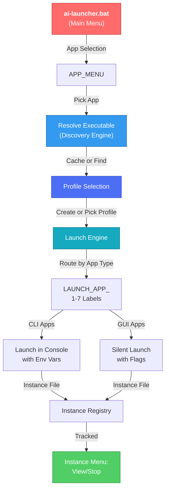

<!-- PROJECT HEADER -->
<br />
<div align="center">
  <a href="https://github.com/Ali-hey-0/AI-Launcher-Framework">
    
  </a>

  <h1 style="font-size: 3rem;">AI Desktop Launcher Framework</h1>

  <p>
    🚀 Launch multiple isolated AI desktop apps on Windows – one click, unlimited profiles, zero bloat.
  </p>

  <!-- BADGES -->
  <p>
    <a href="https://github.com/Ali-hey-0/AI-Launcher-Framework/releases">
      
    </a>
    <a href="https://github.com/Ali-hey-0/AI-Launcher-Framework/blob/main/LICENSE">
      
    </a>
    
    
    <a href="https://github.com/Ali-hey-0/AI-Launcher-Framework/stargazers">
      
    </a>
    <a href="https://github.com/Ali-hey-0/AI-Launcher-Framework/network/members">
      
    </a>
    
  </p>

  <p>
    <a href="#-quick-start">Quick Start</a> •
    <a href="#-features">Features</a> •
    <a href="#-supported-applications">Supported Apps</a> •
    <a href="#-architecture">Architecture</a> •
    <a href="#-faq">FAQ</a> •
    <a href="#-author-opinion">Author's Opinion</a>
  </p>
</div>

<details>
  <summary><strong>📑 Table of Contents</strong> (click to expand)</summary>

- [🚀 Quick Start](#-quick-start)
- [✨ Features](#-features)
- [🎯 Supported Applications](#-supported-applications)
- [🏗️ Architecture – The N→N Model](#️-architecture--the-nn-model)
- [📋 Prerequisites](#-prerequisites)
- [💾 Installation](#-installation)
- [🖥️ Usage](#️-usage)
  - [Main Menu Navigation](#main-menu-navigation)
  - [Profile Management](#profile-management)
  - [Instance Management](#instance-management)
- [🔧 Customization](#-customization)
  - [Adding New Applications](#adding-new-applications)
  - [Changing Profile Storage Path](#changing-profile-storage-path)
  - [Custom Executables](#custom-executables)
  - [Environment Variables](#environment-variables)
- [🗂️ File Structure](#️-file-structure)
- [🔐 Security & Isolation](#-security--isolation)
- [🆚 Comparison with Alternatives](#-comparison-with-alternatives)
- [❓ FAQ](#-faq)
- [🛠️ Troubleshooting](#️-troubleshooting)
- [📄 License](#-license)
- [🤝 Contributing](#-contributing)
- [💬 Support](#-support)
- [⭐ Show Your Support](#-show-your-support)
- [✒️ Author's Opinion](#️-authors-opinion)
</details>

---

## 🚀 Quick Start

1. **Download** the [latest `ai-launcher.bat`](https://github.com/Ali-hey-0/AI-Launcher-Framework/releases/latest) from this repository.
2. **Double‑click** the script.
3. **Select an AI app** and a profile, then launch instantly.

Create as many profiles as you need for each application – they all run side‑by‑side, completely isolated.

> 💡 No installation, no admin rights needed. The script and its `Launcher` folder live wherever you put them.

### 📸 See It In Action

<div align="center">
  
  <p><em>Multiple AI applications running simultaneously with full profile isolation</em></p>
</div>

---

## ✨ Features

- 🎯 **Multi‑Application Support** – Manage Codex, Claude Desktop, Claude Code, Cursor, Windsurf, Gemini, and custom executables from one launcher.
- 🧩 **True Profile Isolation** – Each profile keeps cookies, sessions, extensions, and settings strictly separated per application.
- ⚡ **One‑Click Launcher** – Intuitive hierarchical menu system; select app → profile → launch.
- 🔍 **Smart Auto‑Detection** – Automatically finds installed applications using AppX packages, Registry, PATH, and LocalAppData.
- 💾 **Persistent Profile Management** – Create, select, and delete profiles with automatic metadata tracking (creation time, last launch).
- 📦 **Zero Dependencies** – A single, pure Windows Batch file (~2 KB) plus a portable `Launcher` folder.
- 🛡️ **Safe by Design** – Leverages official Chromium/Electron flags; profiles are simple folders you can back up or delete.
- 📊 **Instance Tracking** – View running instances, launch multiple instances of the same app, and stop them individually or in bulk.
- 🎨 **Highly Customizable** – Add new apps, configure discovery paths, or hardcode executables within minutes.
- 🧵 **Concurrent Friendly** – Run as many instances as your RAM allows; all tracked intelligently.

---

## 🎯 Supported Applications

| Application | Isolation Method | Status | Discovery Method |
|---|---|---|---|
| **OpenAI Codex Desktop** | `CODEX_HOME` env var | ✅ Supported | AppX (WindowsApps) |
| **Anthropic Claude Desktop** | `--user-data-dir` flag | ✅ Supported | LocalAppData |
| **Claude Code (CLI)** | `CLAUDE_CONFIG_DIR` env var | ✅ Supported | PATH |
| **Cursor** | `--user-data-dir` + `--extensions-dir` | ✅ Supported | LocalAppData |
| **Windsurf** | `--user-data-dir` + `--extensions-dir` | ✅ Supported | LocalAppData |
| **Gemini Desktop** | (No isolation mechanism) | ⚠️ Experimental | LocalAppData |
| **Custom Executable** | (None – user-defined) | ✅ Supported | Manual Path Entry |

**Note:** Experimental apps launch normally (single shared profile) but still benefit from organized profile folders and instance tracking.

---

## 🏗️ Architecture – The N→N Model

Every Electron/Chromium app honours the `--user-data-dir` command‑line flag or respects custom environment variables. When you supply a unique folder path, **all local state** – authentication tokens, preferences, extensions, cache – is stored in that folder exclusively.

This framework takes **one** installed copy of any app executable and launches **N** independent processes, each pointed at a distinct profile folder. The result is a clean **N executables → N independent profiles** architecture.



Every profile is completely independent:
- 🔒 Cookies and session tokens never cross between profiles
- 🔄 Extensions/cache per profile (where applicable)
- 📂 Simple folder structure – back up, encrypt, or delete any profile without affecting others
- ⏱️ Automatic creation/modification timestamps

---

## 📋 Prerequisites

| Component | Minimum | Recommended |
|---|---|---|
| **Windows** | Windows 10 (build 19041+) | Windows 11 22H2+ |
| **Target Apps** | App must be installed on system | Latest stable version |
| **Permissions** | Standard user | Standard user |
| **Disk Space** | ~100 MB total | 2+ GB free on system drive |

**Note:** The script uses read-only discovery methods; no special permissions are required. If an app is installed but not found, you can manually specify its path via the "Locate / Re-locate Executable" menu.

---

## 💾 Installation

### Option 1: Clone the Repository (Git)

```bash
git clone https://github.com/Ali-hey-0/AI-Launcher-Framework.git
cd AI-Launcher-Framework
```

Then double‑click `ai-launcher.bat`.

### Option 2: Download the Latest Release

1. Visit the [releases page](https://github.com/Ali-hey-0/AI-Launcher-Framework/releases).
2. Download `ai-launcher.bat` and save it anywhere (Desktop, Documents, USB stick, etc.).
3. The script will automatically create a `Launcher` folder next to itself on first run.

### Option 3: Portable USB Setup

1. Download `ai-launcher.bat`.
2. Copy it to your USB stick.
3. Run it from the USB – the `Launcher` folder stays on the USB and travels with you.

**🔧 Optional:** Create a shortcut to `ai-launcher.bat`, set a custom icon, and pin it to your taskbar for quick access.

---

## 🖥️ Usage

### Main Menu Navigation

Launch the script by double‑clicking or via command line:

```
C:\Tools> ai-launcher.bat
```

You'll see the main menu:

```
===============================================================
              AI Desktop Launcher Framework
===============================================================

  1. Select AI Application & Launch
  2. Manage Profiles
  3. Manage Running Instances
  4. Locate / Re-locate Executable
  5. Refresh Detection (clear cache)
  6. Settings
  7. Exit

===============================================================
Enter your choice (1-7):
```

### Profile Management

**From Option 1 (Select AI Application):**

1. Choose an application from the auto-generated menu (all 7 apps listed with status).
2. View existing profiles or create a new one.
3. Select how many instances to launch (default: 1).
4. Watch each instance spawn with isolated data.

**From Option 2 (Manage Profiles):**

- Create new profiles for any app.
- View profile metadata (creation date, last launch).
- Delete profiles you no longer need.
- Profiles are organized as `Launcher\Profiles\<AppName>\<ProfileName>\`.

### Instance Management

**From Option 3 (Manage Running Instances):**

- **View All Instances:** See every launched instance with app name, profile, PID, and status (Running/Stopped).
- **Stop a Specific Instance:** Select by number; the launcher terminates it gracefully.
- **Stop All Instances:** Emergency bulk shutdown (requires `YES` confirmation).
- **Launch All:** Start one instance of every Supported app using the default profile (Experimental apps are skipped).

**Instance Records:**
- Stored in `Launcher\instances\<AppName>__<ProfileName>.instance`.
- Each record includes timestamp, PID, app name, profile, and executable path.
- Records persist even if instances are closed, so you can view launch history.

---

## 🔧 Customization

Open `ai-launcher.bat` with any text editor (Notepad, VS Code, etc.). All configuration is at the top of the file in the `:INIT_APPS` label.

### Adding New Applications

1. Locate the `:INIT_APPS` label in the script.
2. Find the highest `APP_<N>_*` block and increment N.
3. Copy this template and fill in the fields:

```batch
set "APP_8_NAME=My New App"
set "APP_8_EXE_HINT=MyApp.exe"
set "APP_8_DISCOVERY=LOCALAPPDATA"
set "APP_8_LAD_SUBPATH=MyApp\MyApp.exe"
set "APP_8_ISOLATION=USERDATA"
set "APP_8_STATUS=Supported"
set "APP_8_CLI=0"
```

4. Create a new `:LAUNCH_APP_8` label near the other launch labels:

```batch
:LAUNCH_APP_8
set "PROFILE_PATH=%APP_PROFILE_DIR%\%SEL_PROFILE%"
if not exist "%PROFILE_PATH%" mkdir "%PROFILE_PATH%" >nul 2>&1
for /l %%i in (1,1,%INSTANCES%) do (
    call :LAUNCH_GUI "%EXE_PATH%" "--your-app-flag=\"%PROFILE_PATH%\""
)
goto LAUNCH_DONE
```

5. **Important:** Add one line to the `:DISPATCH_LAUNCH` label:

```batch
if "%SEL_APP%"=="8" goto LAUNCH_APP_8
```

6. Update `APP_COUNT` at the top of `:INIT_APPS` to the new number.

**Discovery Methods:**
- `APPX` – Windows Store packages (e.g., OpenAI Codex)
- `LOCALAPPDATA` – Apps in `%LOCALAPPDATA%` (e.g., Claude Desktop, Cursor)
- `PATH` – CLI tools on system PATH (e.g., Claude Code)
- `MANUAL` – User provides the path (e.g., Custom Executable)

**Isolation Types:**
- `USERDATA` – Pass `--user-data-dir=<profile>` (standard Electron flag)
- `ENVVAR` – Set environment variable (e.g., `CODEX_HOME=<profile>`)
- `NONE` – No isolation (app uses shared profile)

### Changing Profile Storage Path

By default, profiles live in `Launcher\Profiles`. To change this, edit the `:GLOBAL PATHS` section:

```batch
set "PROFILES_ROOT=D:\MyAIProfiles"
```

All per-app profile folders will be created under this new root automatically.

### Custom Executables

The launcher includes a **Custom Executable** entry (App #7) that lets you:

1. Choose it from the app menu.
2. Manually enter the path to any `.exe` file.
3. Launch it with the same profile/instance infrastructure.

No isolation flags are guessed, so the app runs normally – but it still gets an organized profile folder and instance tracking.

### Environment Variables

Set these **before** running `ai-launcher.bat` to override defaults:

| Variable | Purpose | Default |
|---|---|---|
| `CODEX_PROFILES` | Root folder for all profiles | `%~dp0Launcher\Profiles` |
| `CODEX_EXE` | Full path to a specific app executable | (auto-detected per app) |

Example:

```cmd
set CODEX_PROFILES=D:\MyProfiles
ai-launcher.bat
```

---

## 🗂️ File Structure

```
AI-Launcher-Framework/
├── ai-launcher.bat       # The main launcher script (~2 KB)
├── LICENSE               # MIT License
├── README.md             # This file
└── assets/
    ├── logo.png          # Project logo
    └── screenshot.png    # Screenshot in action
```

The script creates this structure on first run:

```
Launcher/                          # Created next to ai-launcher.bat
├── Profiles/                       # All application profiles
│   ├── OpenAI Codex Desktop/
│   │   ├── default/                # Profile folder (auto-created)
│   │   │   ├── profile.info        # Metadata (creation, last launch)
│   │   │   ├── Local State/
│   │   │   ├── Cache/
│   │   │   └── ...
│   │   ├── work/
│   │   └── personal/
│   ├── Claude Desktop/
│   │   ├── default/
│   │   └── ...
│   ├── Cursor/
│   └── ...
├── cache/                          # Discovery cache (auto-managed)
│   ├── app_1.txt                   # Cached exe path for app 1
│   ├── app_1.ver                   # Version check sidecar
│   └── ...
├── instances/                      # Running instance registry
│   ├── OpenAI Codex Desktop__default.instance
│   ├── Claude Desktop__work.instance
│   └── ...
└── temp/                           # Temporary files (auto-cleaned)
    └── *.tmp
```

---

## 🔐 Security & Isolation

**Profile Isolation:**
- Each profile is a self‑contained Chromium/Electron data folder.
- Cookies, session tokens, localStorage, and IndexedDB are never shared between profiles.
- Extensions are stored per profile (where applicable).
- No registry keys are modified; no system‑wide configuration is touched.

**On-Disk Safety:**
- You can delete a profile folder at any time – all traces of that account vanish instantly.
- No shared state remains that could leak data to other profiles.
- Profiles can be backed up, encrypted (BitLocker, VeraCrypt), or migrated between machines.

**Execution Safety:**
- Each instance runs as a separate process with its own PID.
- The launcher tracks PIDs for graceful shutdown.
- Running instances are verified before being listed (stale PIDs are ignored).

**Honesty Rule:**
- Isolation is **only** implemented using official, documented flags or widely-verified environment variables.
- For apps with no confirmed isolation mechanism (Gemini Desktop), we say so explicitly and launch normally.
- We never invent undocumented flags that might break in future updates.

---

## 🆚 Comparison with Alternatives

| Approach | Isolation | Resource Usage | Ease of Use | Portability | Reliability |
|---|---|---|---|---|---|
| **AI Launcher (this tool)** | ✅ Complete per-profile | 🟢 Minimal | ⭐⭐⭐⭐⭐ | ✅ Portable | ✅ Built-in |
| Multiple Windows user accounts | ✅ Complete | 🔴 Very High (full OS) | ⭐ | ❌ Machine-bound | ⚠️ Complex |
| Sandboxie / Firejail | ⚠️ Partial | 🟡 Moderate | ⭐⭐ | ❌ External | ⚠️ Dependency |
| Virtual Machines | ✅ Complete | 🔴 Extreme | ⭐ | ✅ But large | ✅ Proven |
| Docker | ✅ Complete | 🟡 Moderate | ⭐⭐ | ✅ Container | ❌ Non-native Windows |
| Browser profiles (manual) | ⚠️ Browser-level | 🟢 Minimal | ⭐ | ⚠️ App-specific | ⭐ but limited |

The AI Launcher Framework uniquely combines **complete profile isolation**, **minimal overhead**, **full portability**, and **universal compatibility** with any Electron/Chromium desktop application.

---

## ❓ FAQ

<details>
<summary><strong>Can I run unlimited profiles per application?</strong></summary>

Yes. There is no hard limit. The script is a template – create 5, 50, or 500 profiles. Each one is a simple folder with isolated data. Just remember your disk space!

</details>

<details>
<summary><strong>Can I run multiple instances of the same app simultaneously?</strong></summary>

Absolutely. When prompted for "instances to launch," enter any number (e.g., 5) and the script spawns that many parallel processes, all pointed at the same profile. Each will open in its own window.

</details>

<details>
<summary><strong>Does the launcher affect my original app installations?</strong></summary>

No. The original executables inside `Program Files`, `WindowsApps`, or `LocalAppData` are never touched. Each instance writes exclusively to its own profile folder under `Launcher\Profiles\`.

</details>

<details>
<summary><strong>Can I transfer profiles between machines?</strong></summary>

Yes. Copy the profile folder (e.g., `Launcher\Profiles\Claude Desktop\work\`) to the same relative path on another machine. The app will pick up the exact session, bookmarks, and settings.

</details>

<details>
<summary><strong>What if an app isn't auto-detected?</strong></summary>

Use the "Locate / Re-locate Executable" menu option (4) to manually specify the `.exe` path. The launcher will cache it and use it for all future launches of that app.

</details>

<details>
<summary><strong>How is the discovery cache invalidated?</strong></summary>

The cache is automatically invalidated if:
- The executable no longer exists on disk.
- The executable's file timestamp changes (version update detected).

You can also manually clear the cache via "Refresh Detection" (Option 5) to force a rescan.

</details>

<details>
<summary><strong>Can I add my own non-standard application?</strong></summary>

Yes. Use the "Custom Executable" entry (App #7) to launch any `.exe` with the same profile infrastructure. Or, follow the "Adding New Applications" section to hard-code a new app into the table permanently.

</details>

<details>
<summary><strong>Will this break if an app updates?</strong></summary>

Unlikely. The discovery engine searches multiple locations (AppX, Registry, PATH, LocalAppData), so it adapts to version updates automatically. If an app moves unexpectedly, use "Locate / Re-locate Executable" to set a new path.

</details>

<details>
<summary><strong>Why are experimental apps marked as such?</strong></summary>

An app is marked experimental if no officially documented or widely-verified isolation mechanism exists for it. For example, Gemini Desktop has no confirmed `--user-data-dir` equivalent, so it launches normally (single shared profile). If a mechanism is later confirmed, the status changes to "Supported" with no other edits needed.

</details>

<details>
<summary><strong>Can I automate this with scripts or task scheduling?</strong></summary>

Yes. The launcher itself is pure Batch, so you can:
- Invoke it from another script and pass environment variables.
- Create scheduled tasks that launch specific apps with specific profiles.
- Use the instance registry to verify which apps are currently running.

No official automation API exists yet, but the file structure is designed to support it.

</details>

---

## 🛠️ Troubleshooting

<details>
<summary><strong>"No installation found" – app not detected</strong></summary>

**Cause:** The discovery engine couldn't find the app using its standard locations.

**Fix:**

1. Verify the app is actually installed on your system.
2. Use "Locate / Re-locate Executable" (Option 4) to manually specify the `.exe` path.
3. Check that your user account has read access to the app's installation folder.
4. If installed in a non-standard location, hardcode the path in the `:INIT_APPS` table by setting the full `APP_<N>_<field>` values.

</details>

<details>
<summary><strong>"Access is denied" when running the script</strong></summary>

**Cause:** Windows Defender, antivirus, or permissions issues.

**Fix:**

1. Right‑click `ai-launcher.bat` → **Properties** → check **Unblock** (if the button exists).
2. Try running from a folder where you have full control (e.g., Desktop or Documents).
3. Temporarily disable aggressive antivirus scanning for `.bat` files.
4. If running on a managed corporate machine, contact your IT department.

</details>

<details>
<summary><strong>App windows take a long time to open on first launch</strong></summary>

**Cause:** First-run profile generation (cache, local storage, extensions) is slower on HDDs; also Electron startup overhead.

**Fix:**

1. Wait 2–5 minutes on first launch. Subsequent launches are much faster.
2. If stuck indefinitely, close the window and delete the profile folder. Let it recreate.
3. For faster launches, store profiles on an SSD if possible.

</details>

<details>
<summary><strong>Blank/white window appears instead of the app loading</strong></summary>

**Cause:** GPU acceleration issue or corrupted profile cache.

**Fix:**

1. Close the window.
2. Delete the profile folder (e.g., `Launcher\Profiles\Claude Desktop\work\`).
3. Relaunch – the profile will be recreated fresh.
4. If it persists, try disabling GPU acceleration by adding `--disable-gpu` to the app's launch flags in the script.

</details>

<details>
<summary><strong>Instance tracking shows "PID unknown" or "Stopped" but the app is still running</strong></summary>

**Cause:** PID was not captured at launch time (e.g., app started but was slow to register), or the PIDs rolled over on a long-running system.

**Fix:**

1. This is cosmetic; the app is still running even if the status is wrong.
2. Stop it manually via the Instance Menu.
3. Or just close the app window directly – the launcher will update the status on next refresh.

</details>

<details>
<summary><strong>Multiple app icons appear on the taskbar – is that normal?</strong></summary>

**Yes – this is expected and correct.** Each instance is a separate process with its own window, so Windows treats them independently on the taskbar. This is exactly what we want for profile isolation.

</details>

---

[](https://gitstock.org/Ali-hey-0/AI-Launcher-Framework)

---

## 📄 License

Distributed under the MIT License. See [LICENSE](LICENSE) for more information.

Feel free to use, modify, and share this project freely. No attribution required, but appreciated!

---

## 🤝 Contributing

Contributions are what make the open‑source community so incredible. Any improvements you make are greatly appreciated.

1. **Fork the Project**
2. **Create your Feature Branch** (`git checkout -b feature/AmazingFeature`)
3. **Commit your Changes** (`git commit -m 'Add some AmazingFeature'`)
4. **Push to the Branch** (`git push origin feature/AmazingFeature`)
5. **Open a Pull Request**

**Guidelines:**
- Keep the script lightweight – avoid external dependencies unless absolutely necessary.
- Test your changes on Windows 10+ before submitting.
- Update this README if you add new apps or features.
- Follow the existing code style (indentation, variable naming, label organization).

---

## 💬 Support

- 🐛 **Bug reports & feature requests** → [GitHub Issues](https://github.com/Ali-hey-0/AI-Launcher-Framework/issues)
- 💬 **Community discussions** → [GitHub Discussions](https://github.com/Ali-hey-0/AI-Launcher-Framework/discussions)
- 📧 **Direct contact** → aliheydari1381doc@gmail.com

---

## ⭐ Show Your Support

If this project saved you time or made your life easier, **give it a Star ⭐** on GitHub! It motivates us to keep improving and helps others discover the tool.

<a href="https://www.buymeacoffee.com/alihey0" target="_blank">
  
</a>

---

## ✒️ Author's Opinion

When I first needed multiple Codex accounts open simultaneously, I looked at the obvious solutions: virtual machines, separate Windows users, third‑party sandboxing tools. Every single one of them felt like overkill – bloated, complex, and fragile.

Then I remembered: **Chromium apps have a native `--user-data-dir` flag.** It's not a workaround – it's an intended feature that Electron and Chrome developers use every day for testing, A/B testing, and multi-profile workflows.

Then I realized: **why limit this to one app?** If the same principle works for Codex, it works for Claude, Cursor, Windsurf, and anything else built on Electron or Chromium. So I built a **universal launcher** that handles discovery, profiles, and instance management for any app.

Here's why I believe this is the most elegant, zero‑bloat solution ever:

- **🧬 Native & future‑proof** – No hooks, no patches, no reliance on undocumented behaviour. It works as long as the app is Electron-based.
- **🚫 True zero‑bloat** – The entire framework is a single ~2 KB batch file. Compare that to a multi-gigabyte VM image or sandboxing engine.
- **🔐 Perfect isolation by design** – Each profile is a folder. You can back it up, encrypt it, restore it, or nuke it without touching anything else.
- **🧰 Hackable to the core** – The config table is plain text. Add a new app, swap discovery methods, or customize launch flags – no compilation, no dependencies.
- **🏎️ Resource‑friendly** – Running 4 Claude instances uses only marginally more RAM than 1, because the core runtime is shared. Compare that to 4 VMs or 4 separate Windows user accounts.
- **🌍 Universal** – Works for Codex, Claude, Cursor, Windsurf, and any future Electron app. Add it to the table, and it instantly has profiles, instance tracking, and auto-discovery.

I wrote this script because I needed it myself. Seeing others adopt it, extend it, and adapt it for their workflows – that's the true spirit of open source. Whether you're managing multiple client accounts, isolating workspaces, or just experimenting with different AI tools in parallel – this framework gives you the power to do it **with zero bloat**.

Happy coding – multiple instances at a time. 🚀
